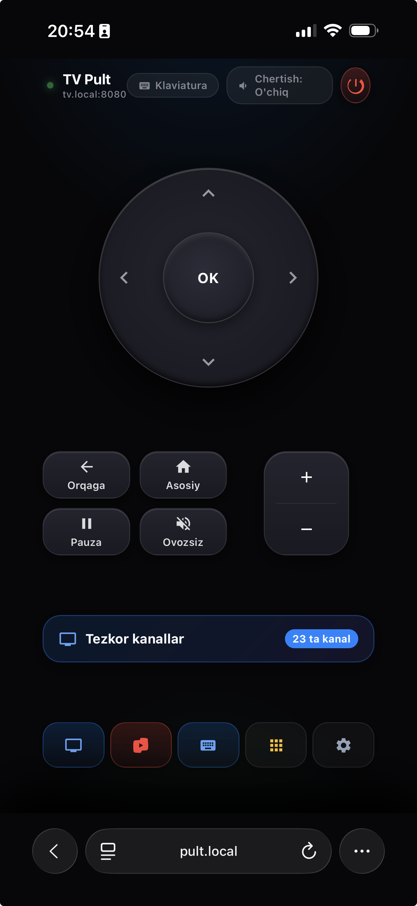

# TVWebRemote 📺

> **Zero-latency local web remote dashboard for Android TV & TV Boxes with an Apple TV Siri Remote aesthetic and zero-config mDNS (`tv.local:8080`).**


-emerald?style=flat-square)


**TVWebRemote** is a lightweight Android service that hosts an embedded, mobile-first Web Remote Dashboard directly on your Android TV box (port `8080`). Anyone connected to your local Wi-Fi can open **`http://tv.local:8080`** in Safari, Chrome, or any browser to instantly control the TV—**no App Store downloads, TestFlight, or client installs required**.

<p align="center">
  
</p>

---

## ✨ Features

- 📡 **Zero-Config mDNS (`tv.local:8080` & `pult.local:8080`)**:
  - Built-in RFC 6762 Multicast DNS responder listening on UDP `5353`.
  - Type `http://tv.local:8080` or `http://pult.local:8080` on any iPhone, Mac, Android, or PC—no need to look up or memorize IP addresses.
  - Dynamically updates with DHCP lease changes and uses NSEC records for instant sub-millisecond dual-stack browser resolution.
- 📱 **Zero-Friction Client**: Open directly in any mobile or desktop web browser.
- 📲 **Add to Home Screen (PWA)**: Full-screen iOS / Android web app with custom app icon, viewport lock, and haptics.
- ⚡ **Ultra-Low Latency (<2ms)**: Native C `/dev/uinput` daemon with UDP transport bypasses slow Android Runtime startup.
- 🎛️ **Apple TV Aesthetic**:
  - Precision **Clickpad**: Circular directional navigation ring with concave center OK button.
  - **Unified Volume Rocker**: Vertical pill rocker for Volume Up and Volume Down.
  - Dedicated **Back**, **TV/Home**, **Menu**, **Power**, and **Pause** controls.
  - **Tactile Audio & Haptic Feedback**: Mechanical click audio synthesizer and tight haptics (`navigator.vibrate`).
- ⌨️ **TV Keyboard & Voice Dictation**:
  - Seamless text input directly from your mobile software keyboard.
  - Full support for mobile microphone voice dictation (🎙️).
  - Built-in Cyrillic-to-Latin transliteration engine (Uzbek & Russian) to prevent Android `input text` crashes.
  - Dedicated controls for `DEL` (Backspace), `Space`, `Enter`, and instant TV field clearing.
- 📑 **iOS 18 Style Bottom Sheet**:
  - Dedicated **Quick Channels** drawer with category filter tabs (*Popular, National, Entertainment*).
  - Real-time instant search filter.
  - Pre-configured channel tuning with instant sequence dialing.
- 🚀 **Quick Apps Row**: One-tap instant launchers for **TelecomTV**, **YouTube TV**, **Keyboard**, **Numpad**, and **Settings**.
- 🇺🇿 **Uzbek Localization**: Clean, intuitive native Uzbek language interface (*TV Pult*).
- 🔄 **Boot & Standby Persistence**: Starts automatically on TV boot (`RECEIVE_BOOT_COMPLETED`), exempted from Doze mode, and holds `WakeLock` + `WifiLock` + `MulticastLock` for 24/7 responsiveness.

---

## 🏗️ Architecture

```
┌────────────────────────────────────────────────────────┐
│               Any Device on Local Wi-Fi                │
│         (iPhone Safari, Android Chrome, Mac)           │
│                                                        │
│            [http://tv.local:8080]                      │
│            [http://pult.local:8080]                    │
└───────────────┬────────────────────────┬───────────────┘
                │ mDNS Query (UDP 5353)  │ HTTP API (TCP 8080)
                ▼                        ▼
┌────────────────────────────────────────────────────────┐
│            Android TV Box                              │
│                                                        │
│   com.bbr.tvwebremote (Foreground Service)             │
│   ├── MdnsResponder (tv.local / pult.local UDP 5353)   │
│   ├── Embedded Multi-threaded HTTP Server (Port 8080)  │
│   ├── KeyDispatcher & Transliteration Engine           │
│   └── BootReceiver & Locks (WakeLock, WifiLock, Mcast) │
└───────────────────────────┬────────────────────────────┘
                            │ Local UDP (Port 7777)
                            ▼
┌────────────────────────────────────────────────────────┐
│          Native tvkey Driver (C / uinput)              │
│   Injects hardware events directly into Linux kernel   │
│   Latency: <1-2ms                                      │
└────────────────────────────────────────────────────────┘
```

---

## 🚀 Getting Started

### Prerequisites
- Android TV box or Android TV device (Android 7.0+ / API 24+)
- Computer with `adb` installed

### Quick Installation
1. Connect to your TV box via ADB:
   ```bash
   adb connect <TV_IP>:5555  # or custom port, e.g. 6060
   ```
2. Build `TVWebRemote.apk`:
   ```bash
   ./build_apk.sh
   ```
3. Install the APK:
   ```bash
   adb install -r -d build/TVWebRemote.apk
   ```
4. Start the service:
   ```bash
   adb shell am startservice com.bbr.tvwebremote/.WebRemoteService
   ```
5. Open your browser on any phone or computer on the same Wi-Fi:
   ```
   http://tv.local:8080
   # or
   http://pult.local:8080
   ```

---

## 🔌 HTTP API

The embedded server exposes a lightweight REST API for automation or external integration:

| Method | Endpoint | Description | Example |
|---|---|---|---|
| `GET` | `/` | Web Remote UI (HTML/CSS/JS) | `curl http://tv.local:8080/` |
| `GET` | `/api/status` | Server status | `curl http://tv.local:8080/api/status` |
| `POST` | `/api/key?name=<key>` | Injects D-pad or function key | `curl -X POST "http://tv.local:8080/api/key?name=up"` |
| `POST` | `/api/text?value=<text>` | Sends text with auto-transliteration | `curl -X POST "http://tv.local:8080/api/text?value=milliy+kino"` |
| `POST` | `/api/clear` | Clears currently active input field | `curl -X POST "http://tv.local:8080/api/clear"` |
| `POST` | `/api/tune?num=<digits>` | Tunes to channel number | `curl -X POST "http://tv.local:8080/api/tune?num=010"` |
| `POST` | `/api/launch?pkg=<id>` | Launches Android application | `curl -X POST "http://tv.local:8080/api/launch?pkg=uz.telecom.telecomtv"` |

### Supported Key Names
`up`, `down`, `left`, `right`, `ok`, `back`, `home`, `menu`, `volup`, `voldown`, `mute`, `power`, `playpause`, `backspace`, `space`, `enter`

---

## 🛠️ Building from Source

No Gradle or Android Studio required—a fast, standalone build script uses standard Android SDK build-tools:

```bash
chmod +x build_apk.sh
./build_apk.sh
```

---

## 📄 License

This project is licensed under the MIT License - see the [LICENSE](LICENSE) file for details.
